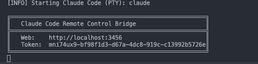
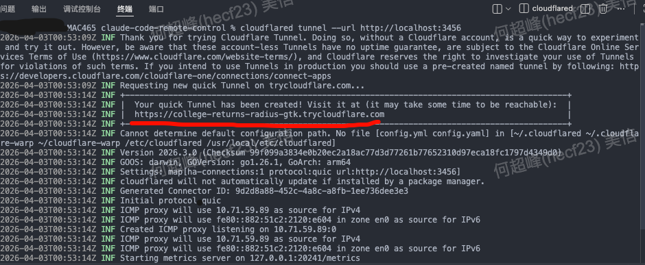
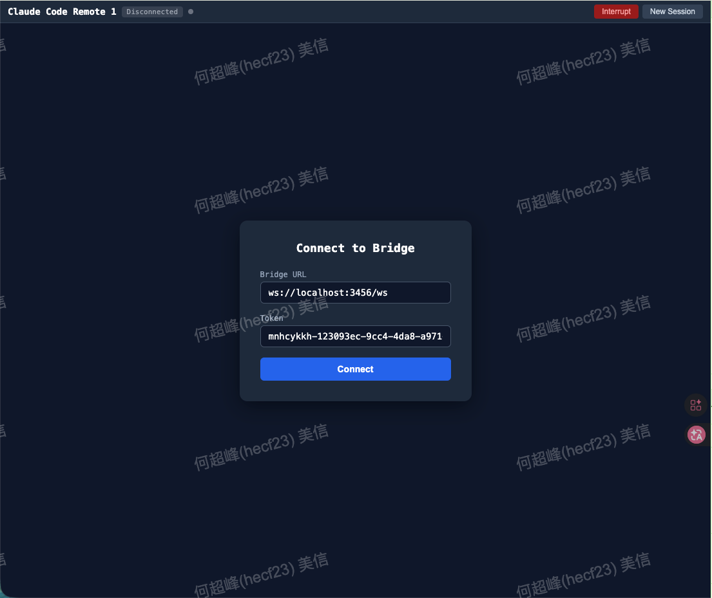
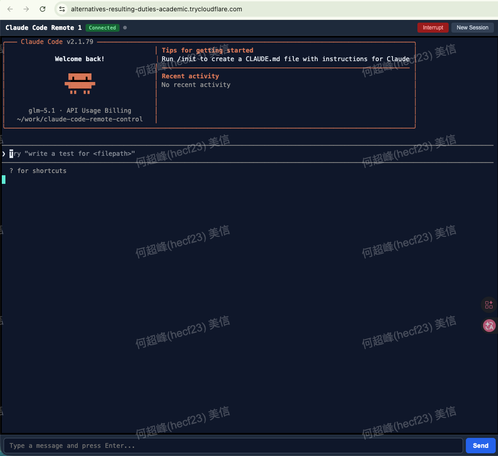

# claude-code-remote-control

通过浏览器（包括手机）远程控制本地 Claude Code CLI。

## 快速开始——远程访问（手机）

### 方式一：一键扫码连接（推荐）

> 前提：电脑本地需要安装cloudflare，加速方法请看文档最后部分 [https://developers.cloudflare.com/cloudflare-one/connections/connect-networks/downloads](https://developers.cloudflare.com/cloudflare-one/connections/connect-networks/downloads/)
```bash
# 检查cloudflared是否已经安装好
cloudflared -v
```

只需一条命令：

```bash
npx claude-code-remote-control serve --tunnel
```

终端会自动启动 cloudflared 隧道并输出 QR 码：

```
╔════════════════════════════════════════════════════════╗
║   Claude Code Remote Control Bridge                    ║
╠════════════════════════════════════════════════════════╣
║   Web:    http://localhost:3456                        ║
║   Token:  a1b2c3d4e5f6                                ║
║   Tunnel: https://xxx.trycloudflare.com                ║
╚════════════════════════════════════════════════════════╝

Scan QR code to connect (expires in 5 min):
█████████████████████████████
██ ▄▄▄▄▄ █▀▄▀▀█ ▄▄▄▄▄ ██
██ █   █ ██▀ ▀█ █   █ ██
██ █▄▄▄█ █▄▀▀▀█ █▄▄▄█ ██
...
```

手机扫码 → 自动连接，无需手动输入 Token。QR 码 5 分钟内有效，过期后需重新启动服务。

如果 cloudflared 未安装或启动超时，会自动降级为本地模式（不影响正常使用）。

### 方式二：手动分步启动

#### 1：启动Bridge Server http://localhost:3456

```bash
npx claude-code-remote-control serve
```



#### 2：启动cloudflared 隧道

```bash
cloudflared tunnel --url http://localhost:3456
```

手机浏览器打开上面划红线的地址

#### 3：cloudflare链接你电脑的bridge server


Bridge URL自动获取，不需要输入手动修改！！   ，输入Bridge server的token ，点击Connect。

#### 4：开始远程对话

进入链接成功的界面，开始对话！到这里你已经成功了！你可以把这个网站发到你手机上操作啦。


## 编程使用

```ts
import { BridgeServer } from 'claude-code-remote-control'

const server = new BridgeServer({
  port: 3456,
  token: 'my-secret',
  claudeCwd: '/path/to/project',
})
await server.start()
```

## CLI 命令参考

### `serve` — 启动 Bridge Server

```bash
npx claude-code-remote-control serve [options]
```

| 选项 | 说明 | 默认值 |
|------|------|--------|
| `-p, --port <port>` | 服务端口 | `3456` |
| `-h, --host <host>` | 服务主机地址 | `0.0.0.0` |
| `--cwd <dir>` | Claude Code 工作目录 | 当前目录 |
| `--model <model>` | 指定 Claude 模型 | 默认模型 |
| `--permission-mode <mode>` | 权限模式：`default` \| `accept-edits` \| `bypass-permissions` | `default` |
| `--tunnel` | 自动启动 cloudflared 隧道，提供公网访问 | 关闭 |
| `-l, --log-level <level>` | 日志级别：`debug` \| `info` \| `warn` \| `error` | `info` |

示例：

```bash
# 默认启动
npx claude-code-remote-control serve

# 指定端口和模型，开启隧道
npx claude-code-remote-control serve --port 8080 --model claude-sonnet-4-6 --tunnel

# 自定义工作目录
npx claude-code-remote-control serve --cwd /path/to/project

# 调试模式
npx claude-code-remote-control serve --log-level debug
```
## Clouldflare安装加速
```bash
# Homebrew 国内镜像加速配置（2026年更新）
export HOMEBREW_BREW_GIT_REMOTE="https://mirrors.ustc.edu.cn/brew.git"
export HOMEBREW_CORE_GIT_REMOTE="https://mirrors.ustc.edu.cn/homebrew-core.git"
export HOMEBREW_BOTTLE_DOMAIN="https://mirrors.ustc.edu.cn/homebrew-bottles"
export HOMEBREW_API_DOMAIN="https://mirrors.ustc.edu.cn/homebrew-bottles/api"
export HOMEBREW_NO_ENV_HINTS="1"

# 再执行Clouldflare安装，看官方文档
# https://developers.cloudflare.com/cloudflare-one/connections/connect-networks/downloads
```
## License

MIT
